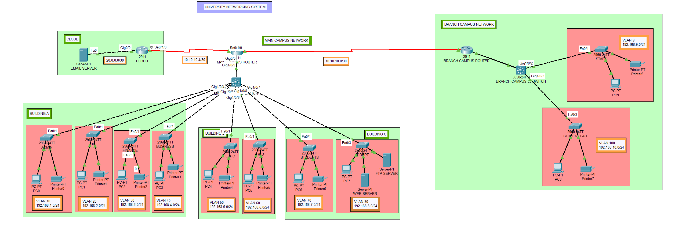

# University Campus Networking System

## Overview

This project presents the design and simulation of a scalable university campus network using Cisco Packet Tracer. The network connects multiple academic departments through Local Area Networks (LANs) while enabling secure and reliable inter-department communication using routing protocols.

The project demonstrates the practical implementation of enterprise networking concepts, including IP addressing, subnetting, VLAN segmentation, inter-VLAN routing, dynamic routing, network services, and end-to-end communication validation.

---

## Features

- Campus network simulation using Cisco Packet Tracer
- Multi-building university topology
- Main Campus and Branch Campus connectivity
- VLAN segmentation (10 VLANs)
- Inter-VLAN Routing (Router-on-a-Stick)
- Dynamic IP allocation using DHCP
- DNS-based hostname resolution
- RIP v2 dynamic routing
- Internal Web Server (HTTP/HTTPS)
- Internal Email Server (SMTP/POP3)
- FTP Server for file transfer
- Printer connectivity
- RIP v2-based dynamic routing between campuses
- End-to-end connectivity verification

---

## Network Services

The campus network provides the following enterprise services:

- DHCP Server – Automatic IP address assignment
- DNS Server – Hostname resolution
- HTTP/HTTPS Server – University web portal
- FTP Server – Internal file transfer
- Email Server – SMTP and POP3 services

---

## Network Architecture

The university campus network is designed using a hierarchical architecture consisting of a Main Campus, Branch Campus, and centralized network services. The infrastructure includes VLAN segmentation, Router-on-a-Stick inter-VLAN routing, RIP v2 dynamic routing, DHCP, DNS, HTTP, FTP, and Email services.

### Overall Network Topology

  

The topology illustrates:

- Main Campus with eight departmental VLANs
- Branch Campus with Staff and Student Lab VLANs
- Router-on-a-Stick implementation
- RIP v2 connectivity between campuses
- Centralized DNS, HTTP, FTP, and Email servers
- End-to-end communication across the university network

---

## Technologies Used

- Cisco Packet Tracer
- TCP/IP
- IPv4
- LAN
- VLAN
- Dynamic Routing
- RIP
- Router Configuration
- Switch Configuration

---

## Project Objectives

- Design a scalable university campus network.
- Connect multiple departments using LAN.
- Configure routers and switches.
- Implement routing for inter-department communication.
- Validate successful communication between all devices.

---

## Folder Structure

- University-Campus-Networking-System
- │
- ├── Network-Topology/
- ├── Configurations/
- ├── Documentation/
- ├── Screenshots/
- └── README.md
  
---

## Testing

- ✔ DHCP Address Assignment
- ✔ VLAN Connectivity
- ✔ Inter-VLAN Routing
- ✔ RIP Routing Verification
- ✔ End-to-End Ping Tests
- ✔ DNS Resolution
- ✔ HTTP Web Server Access
- ✔ FTP Connectivity
- ✔ Email Communication (SMTP/POP3)

---

## Results

The simulated university network successfully achieved:

- Dynamic IP allocation through DHCP
- VLAN segmentation for departmental isolation
- Inter-VLAN communication using Router-on-a-Stick
- RIP v2 dynamic routing between campuses
- Successful DNS name resolution
- Functional HTTP web server
- Functional FTP server
- Internal email communication using SMTP/POP3
- End-to-end connectivity across all departments

---

## Future Improvements

- Implement OSPF or EIGRP for enhanced scalability and faster convergence.
- Configure Access Control Lists (ACLs) to improve network security and traffic filtering.
- Introduce Network Address Translation (NAT) for Internet connectivity.
- Add firewall policies and intrusion prevention mechanisms.

---

## Author

**Sayak Nandi**

B.Tech (Hons.) in Electronics & Communication Engineering (ECE) 
Institute of Engineering & Management (IEM), Kolkata

GitHub: https://github.com/SayakNandi123
